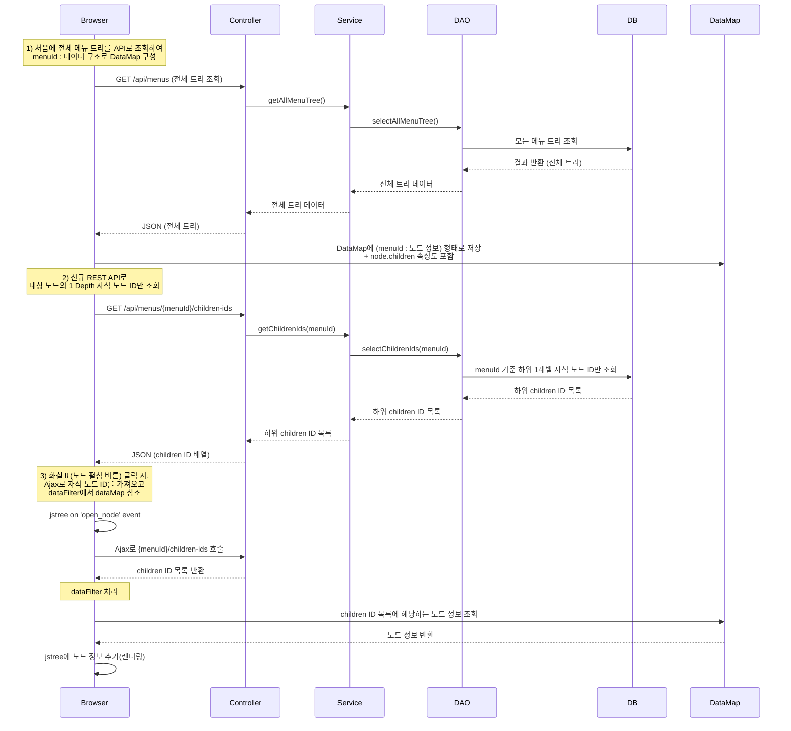

# 2만 개 노드를 가진 메뉴 트리의 최초 로딩 속도 15초 > 4초 개선
⚠️ 아래에 첨부된 모든 코드는 예시용으로 재작성되었습니다.

## 개요

## 기여

## 구현 방식
1.	전체 메뉴 트리 데이터 조회
- `/api/menus` 엔드포인트를 통해 전체 트리를 처음 한 번에 불러오고, 브라우저 측에서 dataMap에 { menuId : 노드 정보 } 구조로 저장.
- 이 때, children 속성을 포함해서, 각 노드가 어떤 자식들을 갖고 있는지(또는 자식 정보 조회에 필요한 key)도 미리 넣어둠.
```javascript
var dataMap = new Map();
$.each(jsonData, function(index, result) {

    dataMap.set(result.id, {
            id : result.menuId,
            level : result.level,
            ...
            , children: // True or False (현재 노드의 hidden 상태와 하위 노드의 개수에 따라 조건부로 정해짐)
        })
});
return dataMap;
```
2.	하위 노드 ID만 조회하는 신규 REST API
- `/api/menus/ajax` 엔드포인트를 추가.
- 트리에서 특정 노드를 펼칠 때, 해당 노드의 직접적인 자식 노드 ID들만 빠르게 조회할 수 있음.
3.	jstree Ajax 호출 & dataFilter
- 사용자가 트리에서 화살표(펼침 버튼)를 누르면, jsTree에서 Ajax 호출로 자식 노드 ID를 가져옴.
- dataFilter 로직에서 dataMap에 이미 저장된 전체 노드 정보를 참조하여, 필요한 자식 노드(실제 데이터)만 가져와 트리에 렌더링.
```javascript
'core' : {
  'data' : {
    'url': '/api/menus/ajax.json',
    'data': function(node) {
      return {
          "par_id": node.id === '#' ? null : node.id,
      }
    },
    'dataFilter': function(data, type) {
      var parsed_data = JSON.parse(data);
      var chd_ids = parsedData.children;
      var chd_lst = [];
      Array.from(chd_ids).forEach((id) => { // options.json_data :: 이미 저장된 전체 노드 정보
        chd_lst.push(options.json_data.get(id));
      });
      return JSON.stringify(children);
    }
  },
...
}
```


## 문제 및 해결 방법
### 기존 jstree 내장 함수인 open_node에서 side effect 발생
#### 📖 배경
#### 🔍 해결 과정
#### ✅ 해결 방법
#### 📌 결론

### 기존 jstree 내장 함수인 refresh에서 side effect 발생
#### 📖 배경
#### 🔍 해결 과정
#### ✅ 해결 방법
#### 📌 결론
